# 🎨 mind-git Architecture Diagrams

## 1. Complete Compilation Pipeline


## 2. Mathematical Foundation Layers


## 3. 1,400-Year Timeline

```mermaid
timeline
    title Mathematical Foundation Timeline

    628 AD : Brahmagupta
           : Complex Numbers (2D)
           : (a² + b²)(c² + d²) = (ac-bd)² + (ad+bc)²

    1748 : Leonhard Euler
         : Four-Square Identity (4D)
         : Quaternion Multiplication
         : Non-commutative algebra

    1843 : William Hamilton
         : Quaternion Discovery
         : i² = j² = k² = ijk = -1

    1928 : Heinrich Degen
         : Eight-Square Identity (8D)
         : Octonion Multiplication
         : Non-associative algebra

    1960 : John Frank Adams
         : Hopf Invariant One Theorem
         : Proved 8D is absolute limit
         : Only 1,2,4,8 support division algebras

    1965 : Albrecht Pfister
         : Pfister Forms
         : 16-square composition
         : Extends beyond normed division

    2025 : mind-git v1.1.0
         : CanvasL Implementation
         : Complete identity chain
         : Formal verification with Coq
```



## 4. Node Classification System


## 5. Spatial to Code Transformation


## 6. Package Structure

```mermaid
graph TB
    subgraph NPM["📦 npm Package: mind-git@1.1.0"]
        Main[Main Entry<br/>logos-system/dist/index.js]
    end

    subgraph Binaries["🔧 CLI Binaries"]
        B1[mind-git<br/>Main compiler]
        B2[mind-git-metadata<br/>Metadata tools]
        B3[pfister-inference<br/>Inference engine]
        B4[universal-kernel<br/>Metadata kernel]
        B5[universal-exporter<br/>Export system]
    end

    subgraph Core["🧮 Core Modules"]
        Poly[polynomial/<br/>F₂ algebra]
        IC[identity-chain/<br/>2D,4D,8D ops]
        AAL[aal/<br/>Assembly-Algebra]
    end

    subgraph Compiler["⚙️ Compiler Modules"]
        Parser[parser/<br/>Canvas → AST]
        CodeGen[codegen/<br/>AST → Code]
        Multi[Multi-language<br/>JS, TS, Racket]
    end

    subgraph Formal["✅ Verification"]
        CoqProofs[Coq Proofs<br/>Polynomials.v]
        IdentityProofs[Identity Chain<br/>IdentityChain.v]
    end

    Main --> B1
    Main --> B2
    Main --> B3
    Main --> B4
    Main --> B5

    B1 --> Parser
    Parser --> Core
    Core --> Poly
    Core --> IC
    Core --> AAL

    Parser --> CodeGen
    CodeGen --> Multi

    Poly --> CoqProofs
    IC --> IdentityProofs

    style NPM fill:#be123c,stroke:#f43f5e,color:#fff
    style Binaries fill:#1e3a8a,stroke:#3b82f6,color:#fff
    style Core fill:#7c2d12,stroke:#f97316,color:#fff
    style Compiler fill:#15803d,stroke:#22c55e,color:#fff
    style Formal fill:#166534,stroke:#10b981,color:#fff
```



## Usage

### Render to PNG/SVG
```bash
# Using Mermaid CLI
npm install -g @mermaid-js/mermaid-cli

# Render all diagrams
mmdc -i architecture-diagrams.md -o diagrams/

# Or render individually
mmdc -i architecture-diagrams.md -o compilation-pipeline.png -s 1
mmdc -i architecture-diagrams.md -o foundation-layers.png -s 2
```

### Embed in Markdown
Simply copy the mermaid blocks into any GitHub README or documentation.

### Export to Image for Social Media
Use https://mermaid.live to:
1. Paste diagram code
2. Customize theme (dark mode recommended)
3. Export as PNG/SVG
4. Use in announcements
