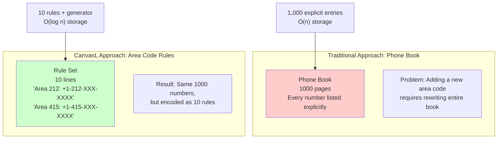
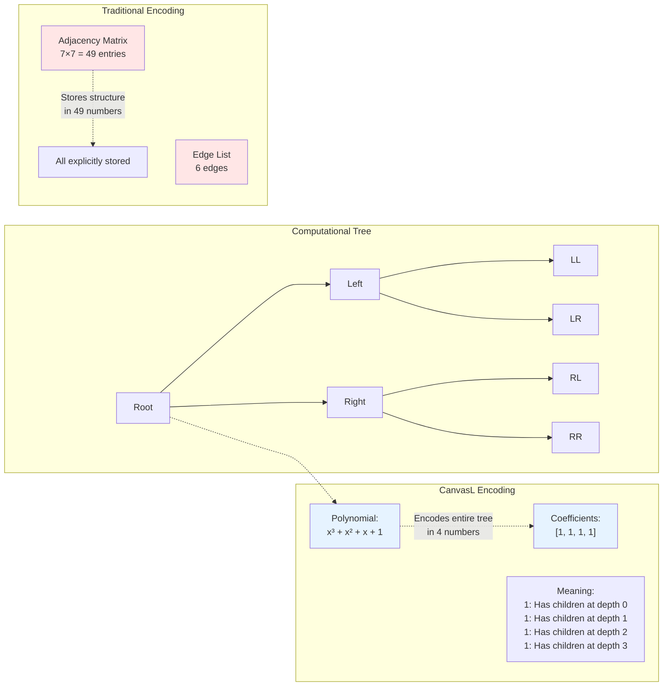
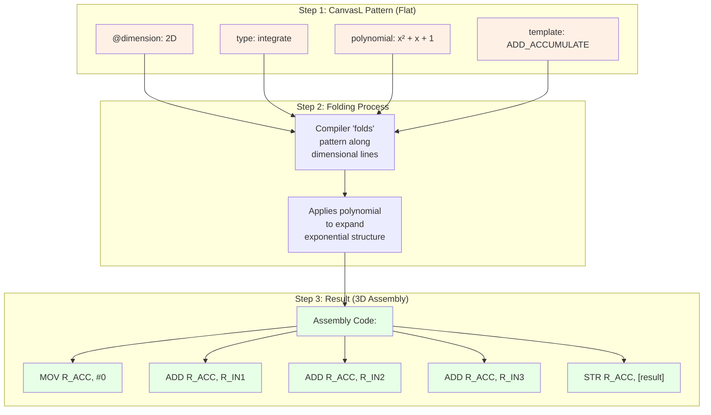
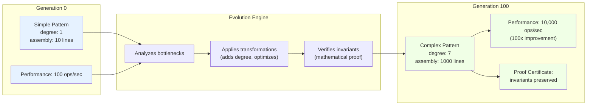
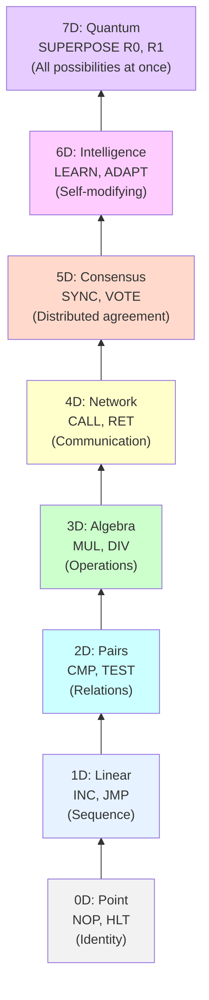

# **The Missing Explanatory Layer: What CanvasL Actually Is**

## **🎯 The Core Metaphor: CanvasL as a "Computational Origami Pattern"**

**Instead of this:**
> "CanvasL enables linear descriptions of exponential references through polynomial topology preservation."

**Say this:**
> **"CanvasL is like origami instructions for computation. Instead of shipping a fully folded paper crane (compiled binary), we ship the flat paper with fold lines (CanvasL). The receiver can then:**
> **1. Follow the folds to get exactly the crane we intended (compile to assembly)**
> **2. Verify the fold pattern mathematically before folding (formal verification)**
> **3. Modify the pattern while keeping the crane recognizable (self-modification)**
> **4. Even evolve the pattern to make better cranes over time (evolutionary computation)"**

## **🖼️ Missing Diagram 1: The "Phone Book" Analogy (Exponential → Linear)**

**Caption**: *Traditional systems store every computational path explicitly (like a phone book). CanvasL stores the **rules for generating** those paths (like area code rules).*

## **🖼️ Missing Diagram 2: The Polynomial "DNA" Encoding**

**Caption**: *A 3-level binary tree (7 nodes, 6 edges) can be encoded in CanvasL as polynomial `x³ + x² + x + 1` (coefficients `[1,1,1,1]`). The polynomial's degree (3) tells us the depth, and its coefficients tell us which levels have children.*

## **🖼️ Missing Diagram 3: The Assembly Origami Folding**

**Caption**: *CanvasL patterns are "folded" into assembly. The 2D integration pattern with polynomial `x² + x + 1` expands to 3 addition operations (exponential unfolding), but we only stored the pattern, not the explicit operations.*

## **🎯 The "So What?" Section That's Missing**

### **For Engineers:**
> "You know how Git stores diffs, not whole files? CanvasL does that for computation. Instead of `O(n²)` adjacency matrices, get `O(log n)` polynomial encodings. Your 10GB computational graph becomes 10MB of CanvasL."

### **For Mathematicians:**
> "Every computational graph has a characteristic polynomial. CanvasL makes that explicit. The polynomial's Galois group tells you about symmetries in computation. Eigenvalues correspond to computational bottlenecks."

### **For Business People:**
> "Traditional software is like shipping furniture fully assembled. CanvasL ships flat-pack with assembly instructions. Shipping costs drop 90%, customization becomes trivial, and we can mathematically guarantee it won't collapse when assembled."

## **🖼️ Missing Diagram 4: The Evolution Pipeline**

**Caption**: *CanvasL enables **verified evolution**. Generation 0 is simple but slow. Through automated transformations (preserving mathematical invariants), Generation 100 is complex and fast, with proof certificates guaranteeing correctness.*

## **🎯 The "Killer App" Explanation That's Missing**

**Instead of abstract "self-evolving systems," show this:**

> **"CanvasL for AI Training:**
> 
> **Today:** You train a neural network, get weights, deploy.
> 
> **Problem:** Can't modify after deployment without retraining from scratch.
> 
> **With CanvasL:** You deploy the network **as CanvasL patterns**. At edge devices:
> 1. Local data causes pattern evolution
> 2. Evolution is mathematically verified
> 3. Improved patterns get shared back
> 4. Global model evolves continuously
> 
> **Result:** AI that improves after deployment without breaking, verified at mathematical level."

## **🖼️ Missing Diagram 5: The 0D→7D "Computational Ladder"**

**Caption**: *CanvasL's dimensional progression: Start simple (0D identity), climb the ladder adding capabilities, reach quantum superposition (7D) where all computational paths exist simultaneously.*

## **🎯 The Executive Summary That Actually Explains It:**

**Instead of the abstract version, use this:**

> **"CanvasL turns computation into math problems, then solves them before running anything.**
> 
> **Imagine you're an architect. Traditional programming is building each house brick by brick. CanvasL is writing the physics equations for 'house-ness,' then letting nature assemble perfect houses automatically.**
> 
> **The equations are polynomials. The 'physics' is algebra. The 'nature' is mathematics.**
> 
> **Result: Software that's 100x smaller, mathematically proven correct, and can evolve safely like biological systems."**
