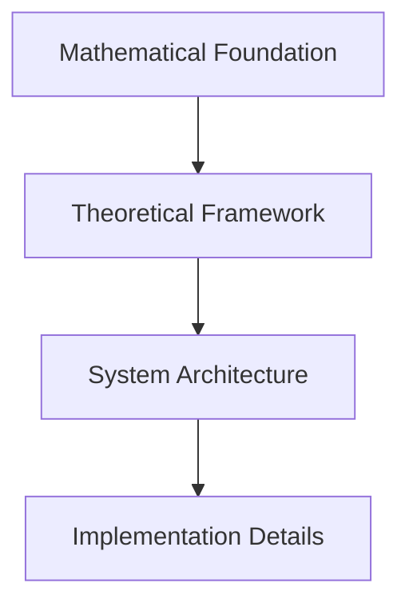

# **CanvasL/MindGit Documentation Standards**

## **Purpose**

This document establishes standards for creating, maintaining, and organizing documentation within the CanvasL/MindGit ecosystem. These standards ensure consistency, quality, and maintainability across all documentation layers.

---

## **Document Structure Standards**

### **Required Sections**
Every document must include the following sections in order:

```markdown
# Document Title

## Overview
[One-paragraph summary of document purpose and scope]

## Relationship to Ecosystem
[How this document fits into the overall CanvasL/MindGit system]

## Prerequisites
[What knowledge or documents are required before reading]

## Core Content
[Main technical content with clear hierarchical sections]

## Dependencies
[What other documents this builds upon]

## Cross-References
[Links to related documents with specific sections]

## Implementation Notes
[Practical considerations for implementation]

## Examples
[Code examples, mathematical proofs, or practical applications]

## Future Extensions
[How this document might evolve]

## Version History
[Change log with dates and descriptions]

## Contributors
[Authors and maintainers]
```

### **Section Guidelines**

#### **Overview**
- Maximum 100 words
- Clear statement of purpose
- Target audience identification
- Key takeaways

#### **Relationship to Ecosystem**
- Position within 7-layer architecture
- Dependencies on other layers
- Impact on ecosystem components
- Stakeholder relevance

#### **Prerequisites**
- Required mathematical background
- Necessary technical knowledge
- Required reading from other documents
- Skill level expectations

#### **Core Content**
- Logical flow from simple to complex
- Clear hierarchical structure (H2, H3, H4)
- Mathematical rigor where applicable
- Practical implementation guidance

#### **Cross-References**
- Bidirectional linking where possible
- Specific section references (not just documents)
- External references with stability considerations
- Link validation requirements

---

## **Content Standards**

### **Mathematical Notation**
- Use LaTeX-style notation for mathematical expressions
- Define all symbols and variables
- Provide intuitive explanations alongside formal proofs
- Include numerical examples where helpful

**Example:**
```markdown
The octonion multiplication follows the Fano plane structure:
```
e_i × e_j = ε_{ijk} e_k
```
where ε_{ijk} is the completely antisymmetric tensor and (i,j,k) form oriented lines in the Fano plane.
```

### **Code Examples**
- Language must be specified in code blocks
- Examples must be tested and functional
- Include input/output where applicable
- Provide error handling examples

**Example:**
```javascript
// CanvasL DNA logging example
const canvasl = new CanvasL();
await canvasl.initDNA();
await canvasl.appendGeneration({
  generation: 1,
  fitness: 0.95,
  octTable: octonionTable
});
```

### **Diagrams and Visualizations**
- Use ASCII art for simple diagrams
- Mermaid syntax for complex flows
- Include alt text for accessibility
- Provide textual descriptions

**Example:**


---

## **File Naming Conventions**

### **Directory Structure**
```
Layer_Number.Category_Name/
├── Document_Name_-_Type.md
├── Subcategory_Name/
│   └── Specific_Document_-_Type.md
└── README.md
```

### **File Naming Rules**
- Use descriptive names (minimum 3 words)
- Separate words with underscores
- Include document type suffix
- Use title case for readability

**Examples:**
- `Hurwitz's_Theorem_1898_-_Complete_Proof.md`
- `CanvasL_DNA_Logging_-_Append_Only_System.md`
- `Production_Hardening_-_Security_Implementation.md`

### **Type Suffixes**
- `_Complete_Proof.md` - Mathematical proofs
- `_Specification.md` - Technical specifications
- `_Implementation.md` - Code implementations
- `_Framework.md` - Conceptual frameworks
- `_Reference.md` - Reference materials
- `_Guide.md` - How-to guides
- `_Analysis.md` - Analytical documents

---

## **Cross-Reference System**

### **Internal References**
Use relative paths with specific section anchors:

```markdown
See [Mathematical Foundation](../1._Mathematical_Foundation/README.md#8d-constraints) for 8D limitations.
```

### **External References**
- Prefer stable, versioned sources
- Include access date for web resources
- Use DOI for academic papers
- Provide alternative sources where possible

### **Bidirectional Linking**
Every important cross-reference should be reciprocal:

```markdown
// In Document A:
See [Octonion Implementation](../4._Implementation_Details/Octonion_Implementation.md) for code details.

// In Document B:
See [Mathematical Foundation](../1._Mathematical_Foundation/Octonion_Algebra.md) for theoretical basis.
```

### **Link Validation**
- All internal links must resolve
- External links checked quarterly
- Use automated link checking tools
- Maintain link status in documentation

---

## **Version Control Standards**

### **Version Numbers**
Use semantic versioning: `MAJOR.MINOR.PATCH`
- **MAJOR**: Significant architectural changes
- **MINOR**: New features or substantial updates
- **PATCH**: Minor corrections, typos, link fixes

### **Change Log Format**
```markdown
## Version History

### v2.1.0 (2025-12-13)
- Added section on quantum measurement
- Updated cross-references to Layer 5 documents
- Fixed mathematical notation in Section 3.2

### v2.0.1 (2025-12-10)
- Corrected typos in Overview
- Updated broken external links
- Added contributor attribution
```

### **Branching Strategy**
- `main`: Stable, released documentation
- `develop`: Work in progress
- `feature/*`: Specific document updates
- `hotfix/*`: Critical corrections

---

## **Quality Assurance Standards**

### **Review Process**
1. **Self-Review**: Author validates against standards
2. **Peer Review**: Domain expert checks technical accuracy
3. **Standards Review**: Documentation team checks compliance
4. **Integration Review**: Cross-reference validation

### **Checklist Items**
- [ ] Structure follows template
- [ ] All required sections present
- [ ] Mathematical notation consistent
- [ ] Code examples tested
- [ ] Cross-references accurate
- [ ] Links validated
- [ ] Spelling and grammar checked
- [ ] Accessibility considered
- [ ] Version history updated
- [ ] Contributors listed

### **Automated Validation**
- Link checking (internal and external)
- Spell checking with technical dictionary
- Markdown syntax validation
- Cross-reference reciprocity checking

---

## **Accessibility Standards**

### **Visual Accessibility**
- Use sufficient color contrast (4.5:1 minimum)
- Provide alt text for all images
- Use semantic HTML structure
- Ensure readability at 200% zoom

### **Cognitive Accessibility**
- Use clear, simple language
- Provide summaries for complex content
- Use consistent terminology
- Include examples and analogies

### **Technical Accessibility**
- Ensure screen reader compatibility
- Provide keyboard navigation
- Use ARIA labels where appropriate
- Test with accessibility tools

---

## **Maintenance Standards**

### **Regular Updates**
- **Quarterly**: Link validation, external reference updates
- **Bi-annually**: Comprehensive review, standards updates
- **Annually**: Architecture assessment, restructuring needs

### **Document Lifecycle**
1. **Draft**: Initial creation, internal review
2. **Review**: Peer review, standards compliance
3. **Published**: Approved, publicly available
4. **Maintenance**: Regular updates, corrections
5. **Deprecated**: Superseded, archived with notice
6. **Archived**: Historical reference only

### **Ownership Matrix**
| Layer | Owner | Reviewer | Maintainer |
|-------|-------|----------|------------|
| 1. Mathematical Foundation | Research Team | Mathematicians | Senior Researchers |
| 2. Theoretical Framework | Architecture Team | Theorists | System Architects |
| 3. System Architecture | Systems Team | Engineers | Senior Engineers |
| 4. Implementation Details | Engineering Team | Developers | Tech Leads |
| 5. Security & Production | DevOps Team | Security Experts | Security Engineers |
| 6. Integration & Ecosystem | Platform Team | API Specialists | Platform Engineers |
| 7. Research & Development | Future Dev Team | Researchers | Research Scientists |

---

## **Tools and Resources**

### **Required Tools**
- **Markdown Editor**: With preview and syntax highlighting
- **Link Checker**: Automated validation (e.g., markdown-link-check)
- **Spell Checker**: With technical dictionary
- **Version Control**: Git with proper branching
- **Diagram Tool**: Mermaid support (e.g., Mermaid Live Editor)

### **Recommended Resources**
- **Markdown Guide**: https://www.markdownguide.org/
- **Mathematical Notation**: https://en.wikibooks.org/wiki/LaTeX/Mathematics
- **Mermaid Syntax**: https://mermaid-js.github.io/mermaid/
- **Accessibility Guidelines**: https://www.w3.org/WAI/WCAG21/quickref/

### **Templates**
- Document template available in `/templates/document-template.md`
- Section templates in `/templates/sections/`
- Example documents in `/examples/`

---

## **Compliance and Enforcement**

### **Standards Compliance**
- All new documents must follow these standards
- Existing documents updated on next major revision
- Exceptions require documented justification and approval

### **Review Process**
- Documentation team conducts quarterly compliance reviews
- Non-compliant documents flagged for updates
- Persistent issues escalated to governance board

### **Recognition Program**
- **Documentation Excellence Award**: Outstanding compliance and quality
- **Innovation Recognition**: Creative solutions to documentation challenges
- **Community Contribution**: Valuable external documentation improvements

---

*These standards are living documents. Updates proposed through the standard change request process and approved by the documentation governance board.*

**Version**: 1.0.0  
**Last Updated**: December 13, 2025  
**Next Review**: March 2025